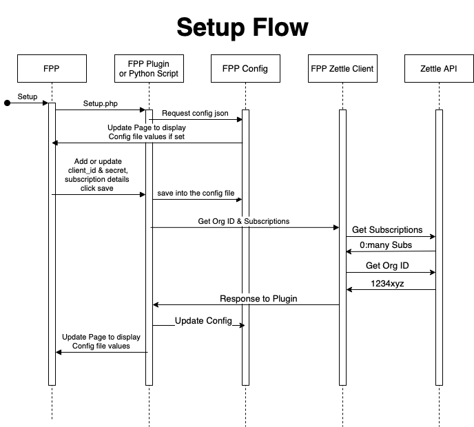
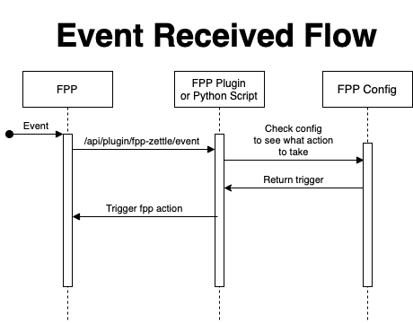

# Design

User installs FPP-Zettle plugin. This will give them the following menus:

Using `menu.inc` at root level define the menus:

- **setup.php** (Updates the config file)
- **status.php** (read the config file. Display subscriptions to events & what they trigger)
- **help.php** (tell users how to get setup with zettle & register api keys (client id & secret))

We can use **api.php** to add endpoints for the plugin.

