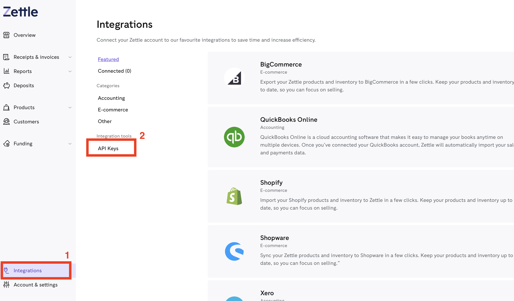

# Announce Zettle!

Get yourself an iZettle device, take a donation & trigger an effect on your light show.

## Getting Started

You'll need an iZettle device to use this plugin.

Either [register](https://register.zettle.com/gb) or [login](https://login.zettle.com/) with Zettle.

- Click 'Integrations' (Bottom Left)
- Click 'API Keys'
- Click 'Create API Key'
- Type a name for your API Key.
- Select 'READ:USERINFO and READ:PURCHASE'
- Click 'Create Key'

You will now be presented with 2 attributes you need to copy & keep safe. They won't be retrievable again so make sure you capture them:
- client_id
- API Key

## Dataplicity Setup

This plugin relies on a secure https endpoint so Zettle can send events to you. The easiest way to set up a https endpoint is to use [Dataplicity](https://www.dataplicity.com)

Greg Macaree has produced an excellent [getting started video](https://youtu.be/7LeD3dz-uXU) for Dataplicity. You need to enable the wormhole setting and save the address, you'll need this later.

<iframe width="560" height="315" src="https://www.youtube.com/embed/7LeD3dz-uXU" title="YouTube video player" frameborder="0" allow="accelerometer; autoplay; clipboard-write; encrypted-media; gyroscope; picture-in-picture" allowfullscreen></iframe>

## FPP

Navigate to your FPP instance. 

Click 'Content Setup' > 'Plugin Manager'

Install the `Announce Zettle` plugin.

Once installed, navigate to 'Content Setup' > 'Zettle - Setup'.

Add your `Client ID` and `Secret` to the page & click 'Save'

This will now unlock the ability to add a `Subscription` that will listen for 'purchases' aka donations from our Zettle device. Enter your Dataplicity wormhole address followed by this plugin's API event path. ie

`https://{wormhole address}/api/plugin/fpp-zettle/event`

`https://wandering-sheep-0157.dataplicity.io/api/plugin/fpp-zettle/event`

Add your email address too. This is the address that is notified of any errors sending (or in Zettle's terminology, pushing) a transaction to your Pi.

Save the subscription.

The first time you create a subscription you will receive a test notification sent to your Raspberry Pi. This is just the Zettle API notifying you that a subscription has been setup.

Once the subscription has been created successfully, you can then add an effect to be triggered. At the moment this plugin can only trigger an effect (ESEQ file), if you have a use case for triggering something else please raise an issue on GitHub, so we can add support.

When a real transaction is received the plugin will log it to a transaction file. You can view transactions in `Status / Control > Zettle - Status`. This page will also allow you to clear any transactions should you wish. This is mearly for you to see what / who has used your Zettle device to donate at your show.

### Privacy Policy

#### What We Collect

Absolutely nothing!

#### What We Don't Collect

We do not collect or store any of your personal information. The information you submit via this plugin is transmitted between your Pi & the Zettle API. Any transactions are kept on your device & are retrievable from Zettle using your API Keys (client_id & secret) should you clear them. 
